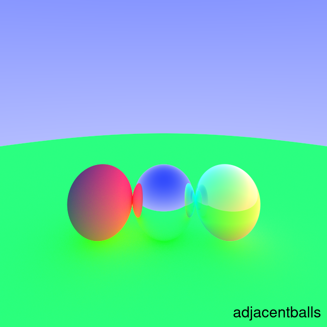
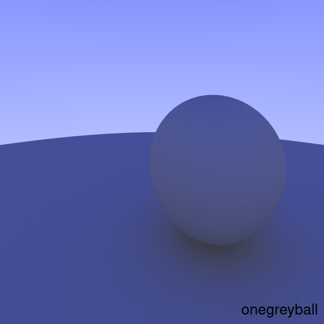
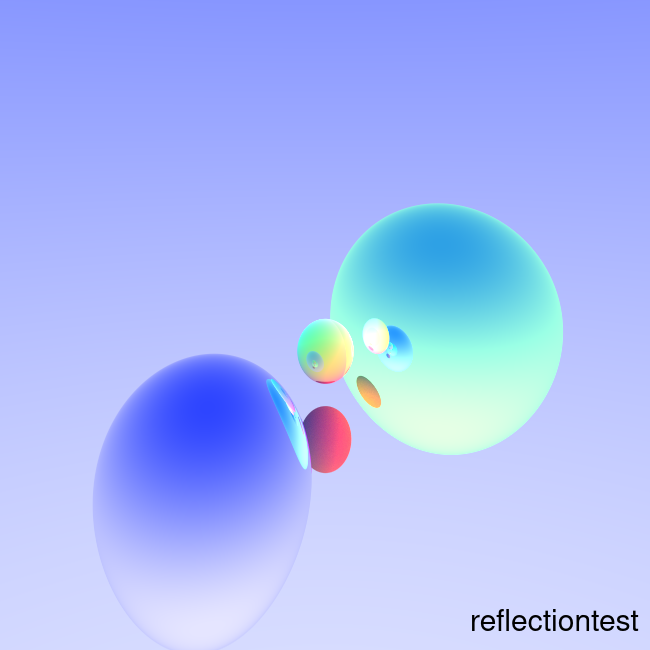
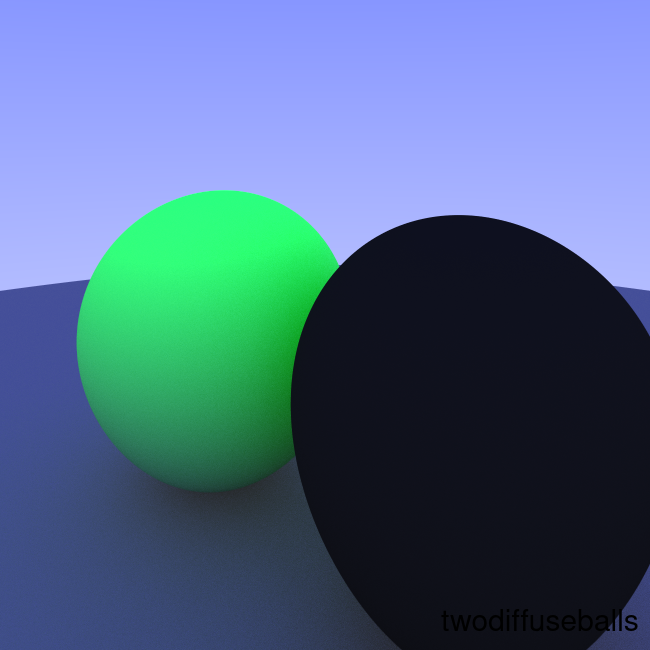
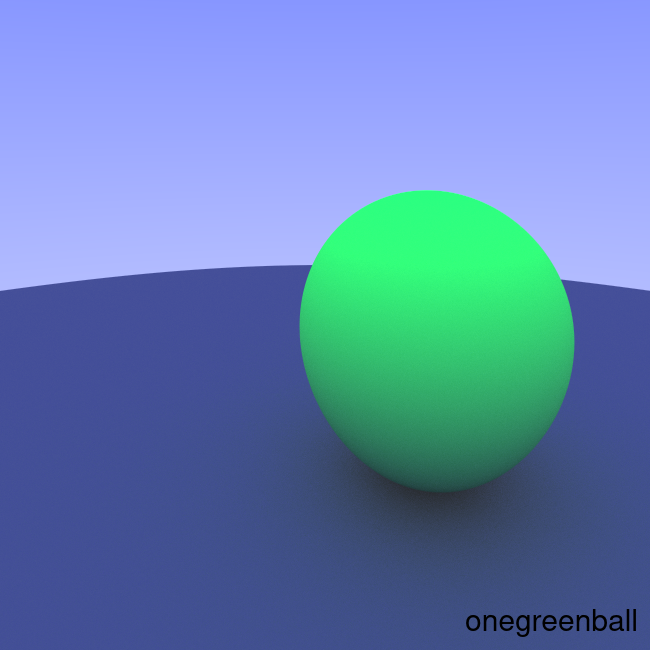
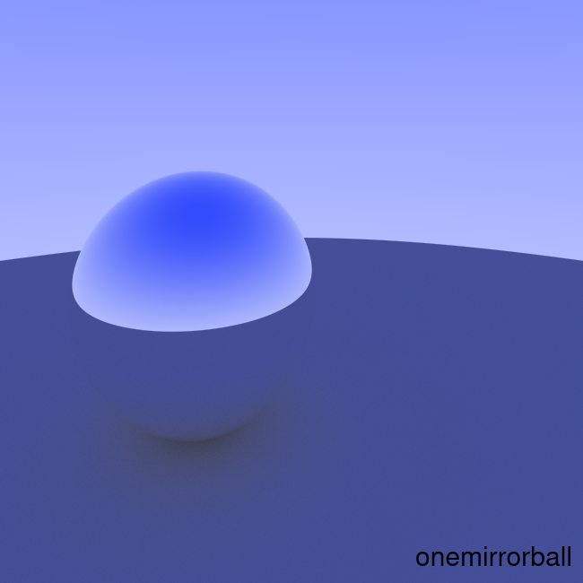
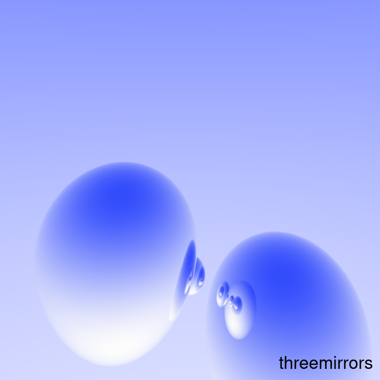
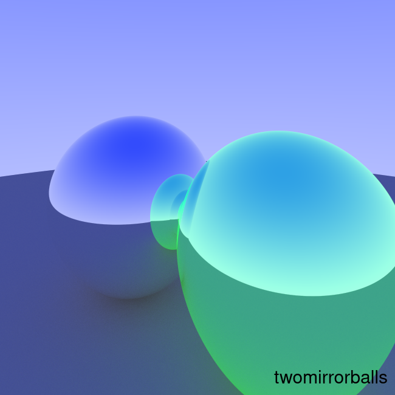

# A Pure SQL Raytracer

Everyone writes a raytracer sooner or later. This is mine.

## Example Outputs

       

## Usage

```shell
sh create.sh
```

The shell script contains host/database/user/pass/etc. There are
no exotic needs other than "postgres, like version 10 and up or
something"

For what it's worth, I created mine thus on my ubuntu desktop:
```shell
sudo su - postgres
createuser --pwprompt raytracer
createdb -O raytracer raytracer
```

### Levers for development and rendering

While doing development, obviously a few-minute render time is a pretty
poor cycle time. There are a few levers you can pull to speed things up
and reduce quality. They're on "camera" and "img" in setup.sql:

* *samples\_per\_px* - This is the number of rays/sub-samples per pixel.
  - 1 or 2 is fine during debugging
  - 15-20 gives "workable" pictures
  - Going above 50 doesn't generate much visible improvement
* *max\_ray\_depth* - The maximum number of ray bounces
  - For simple scenes, it usually makes no more than 5 or so bounces
* *res\_x* and *res\_y* - Final image resolution
  - Smaller is faster

The main CTE carries a lot of stuff that's unnecessary to final output.
This is so I can examine rays bouncing through the scene with:
```sql
SELECT * FROM rays WHERE img_x=100 AND img_y=250
```

## Database

This is implemented in pure SQL. It doesn't do anything like CREATE
FUNCTION or other nonportables.

At the same time, there are some not-entirely-common features of SQL
that it needs:

* JOIN LATERAL
* PARTITION BY inside of a RECURSIVE CTE
* Math functions like SIN()

So although I started developing this in SQLite, I ended up leaning
on PostgreSQL. As I write this, it works in postgres and hasn't been
tested in anything else.

## Interesting Implementation Pieces

Such as it is, I did find myself solving some problems in interesting
ways.

### JOIN LATERAL

JOIN LATERAL is a way to do a correlated subquery in a JOIN, instead of
just in a WHERE clause. I use this as a way to hoist calculations and
do many of them only once and, in some cases, avoid excessive duplication.

### Diffuse Scattering

This requires sampling a uniform sphere. I generate a lot of random
samples ahead of time [sample with rejection -> scale points to sphere
surface], and number them.

Figuring out a way to join each ray to a single random row from these
precalculated scatters was weird; can't just join to RANDOM() because
every ray got joined to the same, random, scatter. Can't just select
with a typical calculation on a normal because that leads to stripes
in the picture.  So, instead, I schlep out a later few decimals of one
dimension of a normal, then join to that. It's "random" but also
unique-enough-per-ray.

### Recursive CTEs

Raytracing very naturally tracks how recursive CTEs work. One of the
things I ran into was a clean way to identify which ray is the one to
account for. Using a window function ordering by intercept (t) worked
well. Every iteration, this query intersects a ray with *everything*
in front of it and does all of the associated calculations, but then in
the WHERE clause will reject everything except the thing the ray
actually hit.

Also, there's something really beautiful about the simplicity of the
core of the final rollup [edited for clarity]:
```sql
 SELECT img_x, img_y,
         SUM(POW(color_mult * ray_col_r/samples_per_px, gamma)) col_r,
         SUM(POW(color_mult * ray_col_g/samples_per_px, gamma)) col_g,
         SUM(POW(color_mult * ray_col_b/samples_per_px, gamma)) col_b
    FROM rays
    GROUP BY img_y, img_x
```

### Scenes, materials, etc

Because this is in SQL, I can store multiple scenes in the database. Which
one is actually rendered is selected in the "camera" table.

## Standing on the Necks of Giants

Two years before I wrote this "The most advanced MySQL raytracer on the
market right now" did the rounds on social media:
https://www.pouet.net/prod.php?which=83222

I had a few things in mind that I wanted to do differently [worse?]:

* Demoscene is an artform. I'm not golfing, this isn't minified
* Not a single query; that can be done with CTEs, but ehhhhhhhh
* Animation as an endgame
* Mainly, I'm just buggering around with the wrong tool for the job

## References

Most of this is built following the "Ray Tracing in One Weekend"
series: https://raytracing.github.io/ , then making allowances for
the deliberately obtuse way I'm coding it.


Gary <chunky@icculus.org>

